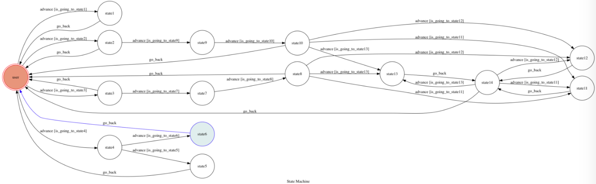

<<<<<<< HEAD
# MovieBot

A telegram movie bot based on a finite state machine ,can search movies and tell you the movies playing now or the movies upcoming ,even recommend you some popular movies

## Setup

### Prerequisite
* Python 3
* python-telegram-bot
* Flask
* transitions
* pygraphviz
* tmdbsimple

#### Install Dependency
```sh
pip3 install -r requirements.txt
```
### To run the bot
##### Run the ngrok
#
```sh
ngrok http 5000
```
After that, `ngrok` would generate a https URL.
You should set `WEBHOOK_URL` (in app.py) to `your-https-URL/hook`.
##### Run the sever
#
```sh
python3 app.py
```

## Finite State Machine


## Usage
The initial state is set to `user`.

Every time `user` state is triggered to `advance` to another state, it will `go_back` to `user` state after the bot replies corresponding message.

* user
    * Input: "Search "keyword""
        * Reply: list the movies name that contain "keyword"

    * Input: "What's the movie palying now?"
        * Reply: list the movies that playing in the theater now and ask "Do you want to get more information?(YES or NO)"
        * Input: `yes` or `no`
            * if  `yes`  
                * Reply: "Which movie do you want to know?(enter a movie name)"
                * Input: A movie name (list above)
                * Reply: Some information of the movie
            * if`no`
                * return to user
    * Input: "What's the movie upcoming?"
        * Reply: list the movies upcoming and ask "Do you want to get more information?(YES or NO)"
        * Input: `yes` or `no`
            * if  `yes`  
                * Reply: "Which movie do you want to know?(enter a movie name)"
                * Input: A movie name (list above)
                * Reply: Some information of the movie
            * if`no`
                * return to user

    * Input: "Can you recommend me some popular movies?"
        * Reply: "Playing in theater now?(YES or NO)"
        * Input: `yes` or `no`
            * if  `yes`  
                * Reply: The most popular movie in the theater now
            * if`no`
                * Reply: Some popular movies recently
=======
# MovieBot
>>>>>>> b239ef4d3d4715b45ae629a9672e529b4235ee8a
